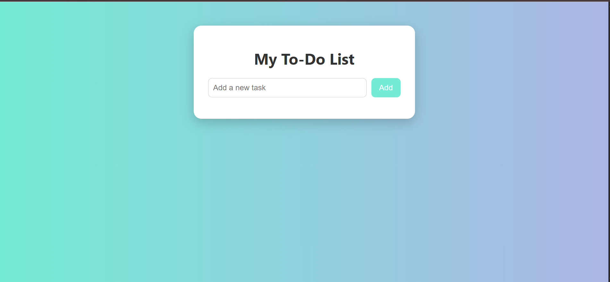

# To-Do List Web App

A simple, stylish, and interactive to-do list web application built using HTML, CSS, and JavaScript.

## Features

- Add new tasks easily
- Mark tasks as completed with a green tick (✅)
- Delete tasks with one click
- Instant UI updates without reloading
- Clean, modern UI with smooth styles and transitions

##  Preview
()

## 🛠️ Technologies Used

- HTML5
- CSS3 (with gradient backgrounds and animations)
- Vanilla JavaScript (ES6+)

## Folder Structure

todo-list-app/
├── index.html # Main HTML file
├── style.css # Custom CSS styling
├── script.js # Core JavaScript logic
└── README.md # Project documentation

## How to Use

1. **Clone or download** this repository.
2. Open the `index.html` file in any modern browser.
3. Start adding your tasks!

## Screenshots

> ()

## Future Improvements (Optional Ideas)

- Save tasks to localStorage
- Add due dates and categories
- Add theme switcher (light/dark)
- Drag-and-drop task reordering

Built with ❤️ using HTML, CSS, and JavaScript.
